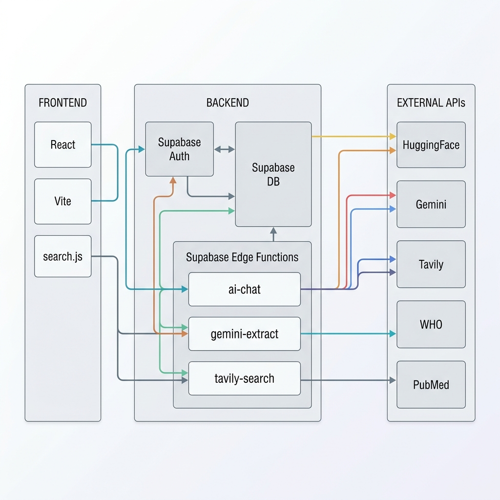
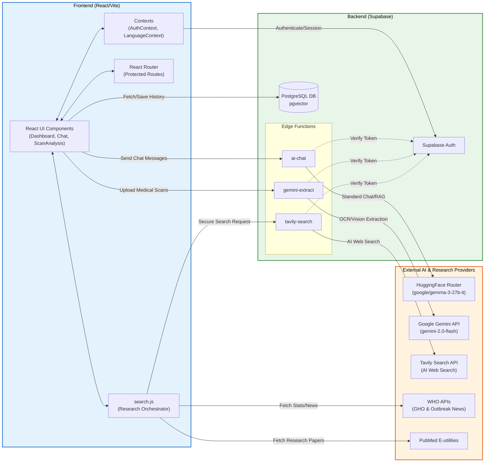

# MedChat-AI System Architecture

Here is the updated visual representation of your system's architecture, including the Research Engine APIs. 

## Detailed Technical Flow Diagram (Mermaid)

This diagram maps out exactly how your current codebase components, including all the external data sources and edge functions, are connected.
*Most markdown previews in IDEs like VS Code will automatically render this diagram.*

